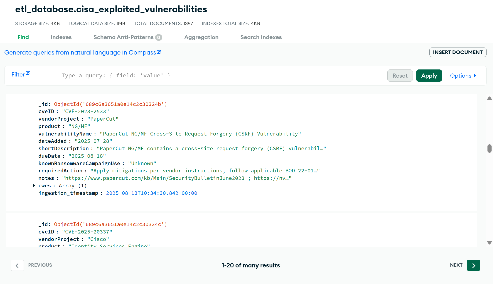

# Software Architecture Assignment: Custom Python ETL Data Connector

This project implements an ETL (Extract, Transform, Load) pipeline in Python that:

1. **Extracts** data from a given API endpoint.
2. **Transforms** the data into a structured format.
3. **Loads** the transformed data into a MongoDB collection.

The script uses environment variables stored in a `.env` file for secure handling of API and database credentials.

## API Endpoint details

### Endpoint Used :

https://www.cisa.gov/sites/default/files/feeds/known_exploited_vulnerabilities.json

- This API provides detailed information about known vulnerabilities, including CVE IDs, vendor details, affected products, descriptions, associated CWEs, and remediation actions.
- The API returns vulnerability information in JSON format.
- This endpoint does not require authentication.

**Sample Response:**

```json
{
  "cveID": "CVE-2025-20337",
  "vendorProject": "Cisco",
  "product": "Identity Services Engine",
  "vulnerabilityName": "Cisco Identity Services Engine Injection Vulnerability",
  "dateAdded": "2025-07-28",
  "shortDescription": "Cisco Identity Services Engine contains an injection vulnerability in …",
  "dueDate": "2025-08-18",
  "knownRansomwareCampaignUse": "Unknown",
  "requiredAction": "Apply mitigations per vendor instructions, follow applicable BOD 22-01…",
  "notes": "https://sec.cloudapps.cisco.com/security/center/content/CiscoSecurityA…",
  "cwes": ["CWE-74"]
}
```

## Response Data Fields

| Parameter                    | Type     | Description                                                                 |
| ---------------------------- | -------- | --------------------------------------------------------------------------- |
| `cveID`                      | `string` | Common Vulnerabilities and Exposures ID.                                    |
| `vendorProject`              | `string` | Vendor or project associated with the vulnerability.                        |
| `product`                    | `string` | Product name affected by the vulnerability.                                 |
| `vulnerabilityName`          | `string` | Title of the vulnerability.                                                 |
| `dateAdded`                  | `string` | Date the vulnerability was added to the database (YYYY-MM-DD format).       |
| `shortDescription`           | `string` | Brief description of the vulnerability.                                     |
| `dueDate`                    | `string` | Due date for applying required mitigations (YYYY-MM-DD format).             |
| `knownRansomwareCampaignUse` | `string` | Indicates if the vulnerability is known to be used in ransomware campaigns. |
| `requiredAction`             | `string` | Recommended mitigation to take.                                             |
| `notes`                      | `string` | Additional notes or links to security advisories.                           |
| `cwes`                       | `array`  | List of Common Weakness Enumeration IDs related to the vulnerability.       |

## Installation

1. **Clone the repository**

```bash
git clone <your_repo_url>
cd <your_repo_folder>
```

2. **Install dependencies**

```bash
pip install -r requirements.txt
```

3. **Environment Variables**

   Create a **`.env`** file in the root directory following the [`ENV_TEMPLATE`](./ENV_TEMPLATE)

4. **Run the ETL script**

```bash
python etl_connector.py
```

# Output Screenshot


